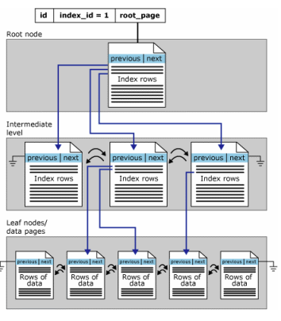
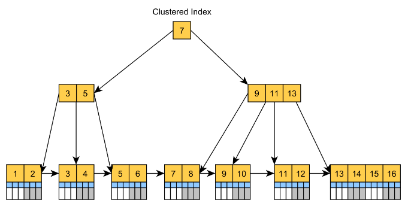

**Cluster Indexing**
A cluster index means telling the database to store the close values actually close to one another on the disk. They can uniquely identify the rows in the SQL table. Every table can have exactly one one clustered index. A cluster index can cover more than one column. By default, a column with a primary key already has a clustered index.

A **dictionary** itself is a table with clustered index. Because all the data is physically stored in alphabetical order.

**Non-Cluster Indexing**
Non-clustered indexing is like simple indexing of a book. They are just used for fast retrieval of data. Not sure to have unique data. A non-clustered index contains the non-clustered index keys and their corresponding data location pointer. For example, a book's content index contains the key of a topic or chapter and the page location of that.

---

**PostgreSQL** does not have direct implementation of **CLUSTER index** like **Microsoft SQL Server**.

In PostgreSQL, we have one `CLUSTER` command which is similar to Cluster Index.

Once you create your table primary key or any other Index, you can execute the CLUSTER command by specifying that Index name to achieve the physical order of the Table Data.

When a table is clustered, it is physically reordered based on the index information. Clustering is a one-time operation: when the table is subsequently updated, the changes are not clustered. That is, no attempt is made to store new or updated rows according to their index order.

**Syntax of Cluster**:
First time you must execute CLUSTER using the Index Name.
```sql
CLUSTER table_name USING index_name;
```
**Cluster the table**:
Once you have executed CLUSTER with Index, next time you should execute only `CLUSTER TABLE` because It knows that which index already defined as CLUSTER.
```sql
CLUSTER table_name;
```
--- 
**PostgreSQL Indexing*
PostgreSQL automatically creates indexes for `PRIMARY KEY` and every `UNIQUE` constraints of a table. Login to a database in PostgreSQL terminal and type \d table_name. All stored indexes will be visualized. If there is a clustered index then it will also be identified.


Note that PostgreSQL uses the term "clustered index" to use something vaguely similar and yet very different to SQL Server.

If a particular index has been nominated as the clustering index for a table, then psql's \d command will indicate the clustered index, e.g.,

```sql
Indexes:
    "timezone_description_pkey" PRIMARY KEY, btree (timezone) CLUSTER
```
PostgreSQL does not nominate indices as clustering indices by default. Nor does it automatically arrange table data to correlate with the clustered index even when so nominated: the CLUSTER command has to be used to reorganise the table data.

---

With a **clustered index** the rows are stored physically on the disk in the same order as the index. Therefore, there can be only one clustered index.

With a **non clustered index** there is a second list that has pointers to the physical rows. You can have many non clustered indices, although each new index will increase the time it takes to write new records.

It is generally faster to read from a clustered index if you want to get back all the columns. You do not have to go first to the index and then to the table.

Writing to a table with a clustered index can be slower, if there is a need to rearrange the data.

---

In **SQL Server**, row-oriented storage both clustered and nonclustered indexes are organized as **B trees**.



The key difference between clustered indexes and non clustered indexes is that the leaf level of the clustered index is the table.

---

**Clustered Index**
A Clustered Index is basically a tree-organized table. Instead of storing the records in an unsorted Heap table space, the clustered index is actually B+Tree index having the Leaf Nodes, which are ordered by the clusters key column value, store the actual table records, as illustrated by the following diagram.

The Clustered Index is the default table structure in **SQL Server** and **MySQL**. While MySQL adds a hidden clusters index even if a table doesn't have a Primary Key, SQL Server always builds a Clustered Index if a table has a Primary Key column. Otherwise, the SQL Server is stored as a Heap Table.

The Clustered Index can speed up queries that filter records by the clustered index key, like the usual CRUD statements. Since the records are located in the Leaf Nodes, there's no additional lookup for extra column values when locating records by their Primary Key values.

For example, when executing the following SQL query on SQL Server:
```sql
SELECT PostId, Title
FROM Post
WHERE PostId = ? 
```

**Non-Clustered Index**
Since the Clustered Index is usually built using the Primary Key column values, if you want to speed up queries that use some other column, then you'll have to add a Secondary Non-Clustered Index.

The Secondary Index is going to store the Primary Key value in its Leaf Nodes, as illustrated by the following diagram:


---

**Clustered Index**
 - There can be only one clustered index for a table.
 - Usually made on the primary key.
 - The leaf nodes of a clustered index contain the data pages.

**Non-Clustered Index**
 - There can be only 249 non-clustered indexes for a table(till sql version 2005 later versions support upto 999 non-clustered indexes).
 - Usually made on the any key.
 - The leaf node of a nonclustered index does not consist of the data pages. Instead, the leaf nodes contain index rows.

 --- 

**Clustered Index**
 - Only one clustered index can be there in a table
 - Sort the records and store them physically according to the order
 - Data retrieval is faster than non-clustered indexes
 - Do not need extra space to store logical structure

**Non Clustered Index**
 - There can be any number of non-clustered indexes in a table
 - Do not affect the physical order. Create a logical order for data rows and use pointers to physical data files
 - Data insertion/update is faster than clustered index
 - Use extra space to store logical structure
 - Apart from these differences you have to know that when table is non-clustered (when the table doesn't have a clustered index) data files are unordered and it uses Heap data structure as the data structure.