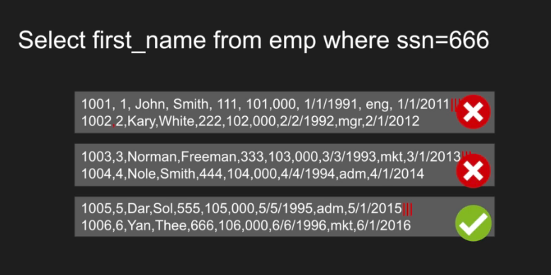
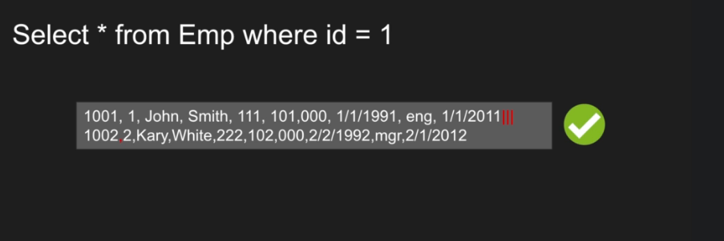

# Database Internals
## [How tables and indexes are stored in disk](#1)
## [Row-based vs Columnar-based Databases](#2)
## [Primary Key (index) and Secondary Key (index)](#3)

## How tables and indexes are stored in disk

Index 10(1,0) = Employee ID 10, Row Number 1, Page 0

## Row-based vs Columnar-based Databases

Each grey box means block

For this query, row-oriented database is slow

## Primary Key (index) and Secondary Key (index)

**Heap** 
 - Table data stored in disk without any indexes.
 - Table data is organized row by row without any order.
 - Usually it has slower access space.
 - There is no order which is maintained by default.
 - Inserted rows will just go bottom of each other.

**Clustering**
 - Usually it is associated with **primary key**, but not always
 - Organizing the table around the **key**, so be default we have to maintain the order
 - By defaults inserted rows should fit that order, that means there is a additional cost associated with ordering
 - In Oracle, it is called **Index Organized Table**
 - Heap is organized around that index
 - It is very efficient for **range queries**

**Nonclustering**
 - secondary index
 - table and index are separated data structures
 - index data structure is usually B-tree
 - table data is not ordered
 - index leafs has pointer to rows of table data
 - if you want to do the search, you have to jump to the index first, the you cand find the Row IDs -> this is the disadvantage of the secondary index

