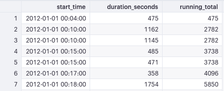
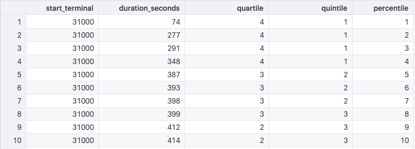

## Intro to window functions

A **window function** performs a calculation across a set of table rows that are somehow related to the current row. This is comparable to the type of calculation that can be done with an aggregate function. But unlike regular aggregate functions, use of a window function does not cause rows to become grouped into a single output row — the rows retain their separate identities. Behind the scenes, the window function is able to access more than just the current row of the query result.

The `ORDER` and `PARTITION` define what is referred to as the "window"—the ordered subset of data over which calculations are made.

**Note**: You can't use window functions and standard aggregations in the same query. More specifically, you can't include window functions in a `GROUP BY` clause.

- [Query 1](#1)
- [Query 2](#2)
- [Query 3](#3)
- [Query 4](#4)
- [Query 5](#5)
- [Query 6](#6)
- [Query 7](#7) 
- [Query 8](#8) ROW_NUMBER()
- [Query 9](#9) ROW_NUMBER() PARTITION BY
- [Query 10](#10) RANK()
- [Query 11](#11) DENSE_RANK()
- [Query 12](#12) NTILE
- [Query 13](#13) NTILE
- [Query 14](#14) LAG and LEAD
- [Query 15](#15) Window Alias


#### <a name="1"></a>Query 1
```sql
SELECT
  start_time,
  duration_seconds,
  SUM(duration_seconds) OVER (
    ORDER BY
      start_time
  ) AS running_total
FROM
  tutorial.dc_bikeshare_q1_2012
ORDER BY
  start_time
```


#### <a name="2"></a>Query 2

```sql
SELECT
  start_terminal,
  start_time,
  duration_seconds,
  SUM(duration_seconds) OVER (
    PARTITION BY start_terminal
    ORDER BY
      start_time
  ) AS running_total
FROM
  tutorial.dc_bikeshare_q1_2012
WHERE
  start_time < '2012-01-08'
ORDER BY
  start_terminal,
  start_time
```


#### <a name="3"></a>Query 3
```sql
SELECT
  start_terminal,
  duration_seconds,
  SUM(duration_seconds) OVER (PARTITION BY start_terminal) AS start_terminal_total
FROM
  tutorial.dc_bikeshare_q1_2012
WHERE
  start_time < '2012-01-08'
```


#### <a name="4"></a>Query 4
Write a query modification of the above example query that shows the duration of each
ride as a percentage of the total time accrued by riders from each start_terminal
```sql
SELECT
  start_time,
  start_terminal,
  duration_seconds,
  SUM(duration_seconds) OVER (PARTITION BY start_terminal) AS start_terminal_sum,
  (
    duration_seconds / SUM(duration_seconds) OVER (PARTITION BY start_terminal)
  ) * 100 AS pct_of_total_time
FROM
  tutorial.dc_bikeshare_q1_2012
WHERE
  start_time < '2012-01-08'
ORDER BY
  2,
  1,
  4 DESC
```


#### <a name="5"></a>Query 5
```sql
SELECT
  start_terminal,
  duration_seconds,
  SUM(duration_seconds) OVER (PARTITION BY start_terminal) AS running_total,
  COUNT(duration_seconds) OVER (PARTITION BY start_terminal) AS running_count,
  AVG(duration_seconds) OVER (PARTITION BY start_terminal) AS running_avg
FROM
  tutorial.dc_bikeshare_q1_2012
WHERE
  start_time < '2012-01-08'
```


#### <a name="6"></a>Query 6
```sql
SELECT
  start_terminal,
  start_time,
  duration_seconds,
  SUM(duration_seconds) OVER (
    PARTITION BY start_terminal
    ORDER BY
      start_time
  ) AS running_total,
  COUNT(duration_seconds) OVER (
    PARTITION BY start_terminal
    ORDER BY
      start_time
  ) AS running_count,
  AVG(duration_seconds) OVER (
    PARTITION BY start_terminal
    ORDER BY
      start_time
  ) AS running_avg
FROM
  tutorial.dc_bikeshare_q1_2012
WHERE
  start_time < '2012-01-08'
ORDER BY
  1,
  2
```


#### <a name="7"></a>Query 7
Write a query that shows a running total of the duration of bike rides (similar to the last example), but grouped by end_terminal, and with ride duration sorted in descending order
```sql
SELECT
  end_terminal,
  duration_seconds,
  SUM(duration_seconds) OVER (
    PARTITION BY end_terminal
    ORDER BY
      duration_seconds DESC
  ) AS running_total
FROM
  tutorial.dc_bikeshare_q1_2012
WHERE
  start_time < '2012-01-08'
```


#### <a name="8"></a>Query 8
`ROW_NUMBER()` does just what it sounds like—displays the number of a given row. It starts are 1 and numbers the rows according to the `ORDER BY` part of the window statement. `ROW_NUMBER()` does not require you to specify a variable within the parentheses:
```sql
SELECT
  start_terminal,
  start_time,
  duration_seconds,
  ROW_NUMBER() OVER (
    ORDER BY
      start_time
  ) AS row_number
FROM
  tutorial.dc_bikeshare_q1_2012
WHERE
  start_time < '2012-01-08'
```


#### <a name="9"></a>Query 9
Using the `PARTITION BY` clause will allow you to begin counting 1 again in each partition. The following query starts the count over again for each terminal:
```sql
SELECT
  start_terminal,
  start_time,
  duration_seconds,
  ROW_NUMBER() OVER (
    PARTITION BY start_terminal
    ORDER BY
      start_time
  ) AS row_number
FROM
  tutorial.dc_bikeshare_q1_2012
WHERE
  start_time < '2012-01-08'
```


#### <a name="10"></a>Query 10
`RANK()` is slightly different from `ROW_NUMBER()`. If you order by `start_time`, for example, it might be the case that some terminals have rides with two identical start times. In this case, they are given the same rank, whereas `ROW_NUMBER()` gives them different numbers. In the following query, you notice the 4th and 5th observations for start_terminal 31000—they are both given a rank of 4, and the following result receives a rank of 6:
```sql
SELECT
  start_terminal,
  start_time,
  duration_seconds,
  RANK() OVER (
    PARTITION BY start_terminal
    ORDER BY
      start_time
  ) AS rank
FROM
  tutorial.dc_bikeshare_q1_2012
WHERE
  start_time < '2012-01-08'
```


#### <a name="11"></a>Query 11
You can also use `DENSE_RANK()` instead of `RANK()` depending on your application. Imagine a situation in which three entries have the same value. Using either command, they will all get the same rank. For the sake of this example, let's say it's "2." Here's how the two commands would evaluate the next results differently:

- `RANK()` would give the identical rows a rank of 2, then skip ranks 3 and 4, so the next result would be 5
- `DENSE_RANK()` would still give all the identical rows a rank of 2, but the following row would be 3—no ranks would be skipped.

Write a query that shows the 5 longest rides from each starting terminal, ordered by terminal, and longest to shortest rides within each terminal. Limit to rides that occurred before Jan. 8, 2012.
```sql
SELECT *
  FROM (
        SELECT start_terminal,
               start_time,
               duration_seconds AS trip_time,
               RANK() OVER (PARTITION BY start_terminal ORDER BY duration_seconds DESC) AS rank
          FROM tutorial.dc_bikeshare_q1_2012
         WHERE start_time < '2012-01-08'
               ) sub
 WHERE sub.rank <= 5
```


#### <a name="12"></a>Query 12
You can use window functions to identify what percentile (or quartile, or any other subdivision) a given row falls into. The syntax is `NTILE`(*# of buckets*). In this case, `ORDER BY` determines which column to use to determine the quartiles (or whatever number of 'tiles you specify). For example:
```sql
SELECT start_terminal,
    duration_seconds,
    NTILE(4) OVER
        (PARTITION BY start_terminal ORDER BY duration_seconds DESC)
        AS quartile,
    NTILE(5) OVER
        (PARTITION BY start_terminal ORDER BY duration_seconds)
        AS quintile,
    NTILE(100) OVER
        (PARTITION BY start_terminal ORDER BY duration_seconds)
        AS percentile
  FROM tutorial.dc_bikeshare_q1_2012
 WHERE start_time < '2012-01-08'
 ORDER BY start_terminal, duration_seconds
```


Looking at the results from the query above, you can see that the percentile column doesn't calculate exactly as you might expect. If you only had two records and you were measuring percentiles, you'd expect one record to define the 1st percentile, and the other record to define the 100th percentile. Using the NTILE function, what you'd actually see is one record in the 1st percentile, and one in the 2nd percentile. You can see this in the results for start_terminal 31000—the percentile column just looks like a numerical ranking. If you scroll down to start_terminal 31007, you can see that it properly calculates percentiles because there are more than 100 records for that start_terminal. If you're working with very small windows, keep this in mind and consider using quartiles or similarly small bands.

#### <a name="13"></a>Query 13
Write a query that shows only the duration of the trip and the percentile into which that duration falls (across the entire dataset—not partitioned by terminal).
```sql
SELECT
  duration_seconds,
  NTILE(100) OVER (
    ORDER BY
      duration_seconds
  ) AS percentile
FROM
  tutorial.dc_bikeshare_q1_2012
WHERE
  start_time < '2012-01-08'
ORDER BY
  1 DESC
```


#### <a name="14"></a>Query 14
It can often be useful to compare rows to preceding or following rows, especially if you've got the data in an order that makes sense. You can use `LAG` or `LEAD` to create columns that pull values from other rows—all you need to do is enter which column to pull from and how many rows away you'd like to do the pull. `LAG` pulls from previous rows and `LEAD` pulls from following rows:
```sql
SELECT
  start_terminal,
  duration_seconds,
  LAG(duration_seconds, 1) OVER (
    PARTITION BY start_terminal
    ORDER BY
      duration_seconds
  ) AS lag,
  LEAD(duration_seconds, 1) OVER (
    PARTITION BY start_terminal
    ORDER BY
      duration_seconds
  ) AS lead
FROM
  tutorial.dc_bikeshare_q1_2012
WHERE
  start_time < '2012-01-08'
ORDER BY
  start_terminal,
  duration_seconds
```


This is especially useful if you want to calculate differences between rows:
```sql
SELECT
  start_terminal,
  duration_seconds,
  LAG(duration_seconds, 1) OVER (
    PARTITION BY start_terminal
    ORDER BY
      duration_seconds
  ) AS lag,
  duration_seconds - LAG(duration_seconds, 1) OVER (
    PARTITION BY start_terminal
    ORDER BY
      duration_seconds
  ) AS difference
FROM
  tutorial.dc_bikeshare_q1_2012
WHERE
  start_time < '2012-01-08'
ORDER BY
  start_terminal,
  duration_seconds
```


The first row of the difference column is null because there is no previous row from which to pull. Similarly, using `LEAD` will create nulls at the end of the dataset. If you'd like to make the results a bit cleaner, you can wrap it in an outer query to remove nulls:
```sql
SELECT *
  FROM (
    SELECT start_terminal,
           duration_seconds,
           duration_seconds -LAG(duration_seconds, 1) OVER
             (PARTITION BY start_terminal ORDER BY duration_seconds)
             AS difference
      FROM tutorial.dc_bikeshare_q1_2012
     WHERE start_time < '2012-01-08'
     ORDER BY start_terminal, duration_seconds
       ) sub
 WHERE sub.difference IS NOT NULL
```


#### <a name="15"></a>Query 15
If you're planning to write several window functions in to the same query, using the same window, you can create an alias. Take the NTILE example above:
```sql
SELECT start_terminal,
       duration_seconds,
       NTILE(4) OVER
         (PARTITION BY start_terminal ORDER BY duration_seconds)
         AS quartile,
       NTILE(5) OVER
         (PARTITION BY start_terminal ORDER BY duration_seconds)
         AS quintile,
       NTILE(100) OVER
         (PARTITION BY start_terminal ORDER BY duration_seconds)
         AS percentile
  FROM tutorial.dc_bikeshare_q1_2012
 WHERE start_time < '2012-01-08'
 ORDER BY start_terminal, duration_seconds
```
This can be rewritten as:

```sql
SELECT start_terminal,
       duration_seconds,
       NTILE(4) OVER ntile_window AS quartile,
       NTILE(5) OVER ntile_window AS quintile,
       NTILE(100) OVER ntile_window AS percentile
FROM tutorial.dc_bikeshare_q1_2012
WHERE start_time < '2012-01-08'
WINDOW ntile_window AS
       (PARTITION BY start_terminal ORDER BY duration_seconds)
ORDER BY start_terminal, duration_seconds
```
The `WINDOW` clause, if included, should always come after the `WHERE` clause.