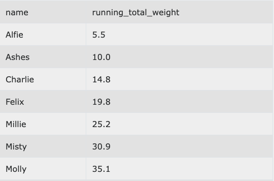
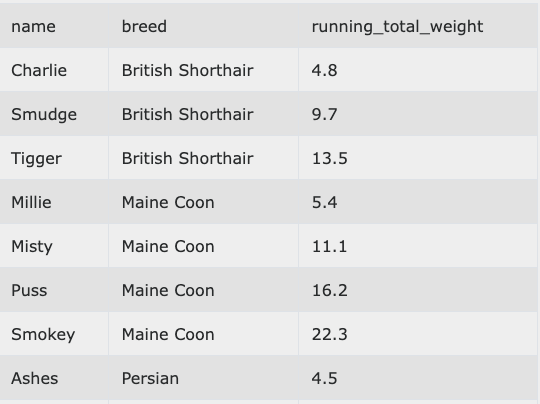
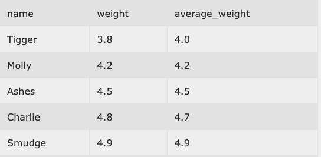
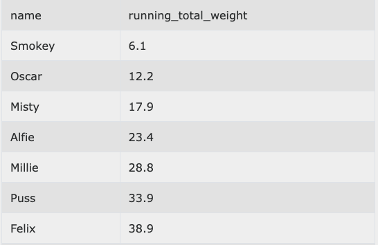
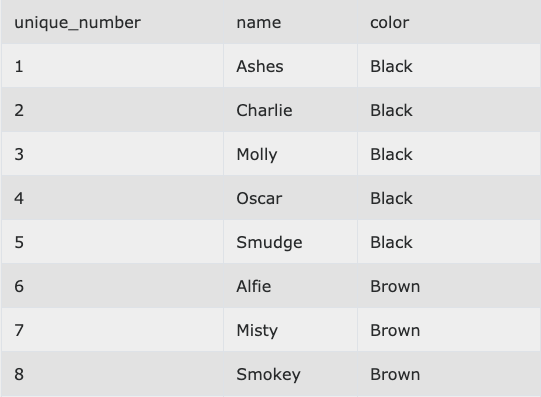
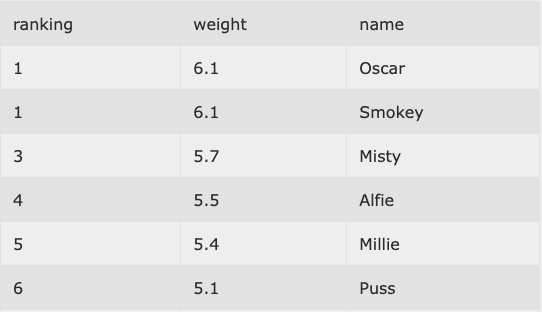
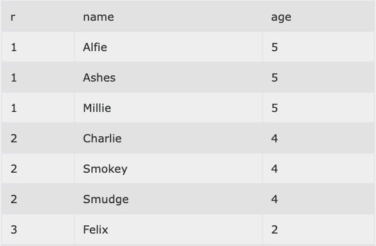
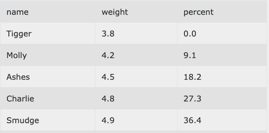

## Window Functions Practice Problems

**cats** table schema

-- name	  varchar

-- breed  varchar

-- weight float

-- color  varchar

-- age    int


- [Problem 1](#1) (Running Totals)
- [Problem 2](#2) (Partitioned Running Totals)
- [Problem 3](#3) (Examining nearby rows)
- [Problem 4](#4) (Correct Running Total)
- [Problem 5](#5) (Unique Numbers)
- [Problem 6](#6) (Ordering)
- [Problem 7](#7) (Further Ordering)
- [Problem 8](#8) (Percentages)
- [Problem 9](#9)


#### <a name="1"></a>Problem 1
The cats must be ordered by name and will enter an elevator one by one. We would like to know what the running total weight is.
```sql
SELECT name,
       sum(weight) OVER (
                         ORDER BY name) running_total_weight
FROM cats
```


#### <a name="2"></a>Problem 2
The cats must be ordered first by breed and second by name. They are about to enter an elevator one by one. When all the cats of the same breed have entered they leave.

We would like to know what the running total weight of the cats is.
```sql
SELECT name,
       breed,
       sum(weight) OVER (PARTITION BY breed
                         ORDER BY name)
FROM cats
```


#### <a name="3"></a>Problem 3
The cats would like to see the average of the weight of them, the cat just after them and the cat just before them.

The first and last cats are content to have an average weight of consisting of 2 cats not 3.
```sql
SELECT name,
       weight,
       avg(weight) OVER (
                         ORDER BY weight ROWS BETWEEN 1 preceding AND 1 FOLLOWING)
FROM cats
```


1 preceding AND 1 FOLLOWING -> 1 preceding + current_row + 1 following

Molly (4.2) = (3.8+4.2+4.5)/3 = 4.2


#### <a name="4"></a>Problem 4
The cats must be ordered by weight descending and will enter an elevator one by one. We would like to know what the running total weight is.
```sql
SELECT name,
       sum(weight) OVER (
                         ORDER BY weight DESC ROWS BETWEEN UNBOUNDED preceding AND CURRENT ROW)
FROM cats
```


Use `Unbounded Preceding` to make sure you don't include extra rows if 2 rows evaluate to the same thing

#### <a name="5"></a>Problem 5
The cats form a line grouped by color. Inside each color group the cats order themselves by name. Every cat must have a unique number for its place in the line.

We must assign each cat a unique number while maintaining their color & name ordering.
```sql
SELECT row_number() OVER (ORDER BY color,name) unique_number,
       name,
       color
FROM cats
```


#### <a name="6"></a>Problem 6
We would like to find the fattest cat. Order all our cats by weight.

The two heaviest cats should both be 1st. The next heaviest should be 3rd.
```sql
SELECT rank() OVER (ORDER BY weight DESC) ranking,
       weight,
       name
FROM cats
ORDER BY ranking,name
```


#### <a name="7"></a>Problem 7
For cats age means seniority, we would like to rank the cats by age (oldest first).

However we would like their ranking to be sequentially increasing.
```sql
SELECT  dense_rank() OVER ( ORDER BY age DESC) r,
        name,
        age
FROM cats
ORDER BY r,name
```


`dense_rank()` differs from `rank()` as it increases sequentially.
Consider a race where 2 people finished first. Dense_rank assigns the next person 2nd. Rank assigns them 3rd.

#### <a name="8"></a>Problem 8 
Each cat would like to know what percentage of other cats weigh less than it
```sql
SELECT name,
       weight,
       percent_rank() OVER (ORDER BY weight) * 100 percent
FROM cats
ORDER BY weight
```


`percent_rank()` scores everything from 0 - 1 allowing us to generate distributions or percentiles